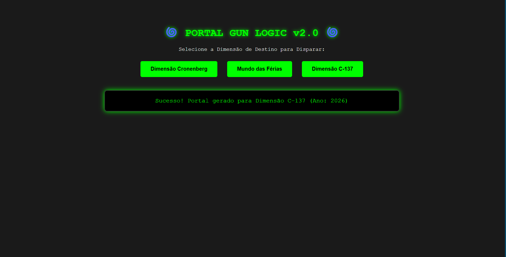

# 🌀 Sistema Interdimensional - C-137 OS

Este é o sistema operativo oficial para o controlo da **Arma de Portais (Portal Gun)** do Rick Sanchez (Dimensão C-137), desenvolvido inteiramente em **Perl**.

## 🚀 Funcionalidades
* **C-137_Web.pl:** Interface gráfica moderna que roda diretamente no navegador de internet (via Mojolicious::Lite), permitindo escolher o destino interdimensional através de botões néon.
* **C-137_OS.pl:** Lógica de cálculo de coordenadas para evitar linhas temporais instáveis ou dimensões infestadas por Cronenbergs.
* **Filtro de Perigo:** Alertas automáticos visuais na consola para níveis de ameaça Extremos ("Wubba Lubba Dub Dub!").

## 🛠️ Tecnologias Utilizadas
* **Perl 5**
* **Mojolicious::Lite** (Para o servidor web local)
* **HTML5 / CSS3** (Para o visual estilo terminal de ficção científica)

## 🌌 Como Executar a Máquina Localmente
1. Certifique-se de que tem o Perl instalado.
2. Instale o módulo web no terminal: `cpanm Mojolicious`
3. Ligue o servidor: `perl C-137_Web.pl daemon`
4. Abre o navegador em: `http://localhost:3000`

---
*Desenvolvido com o rigor científico do multiverso. Não destrua a sua própria realidade.*
